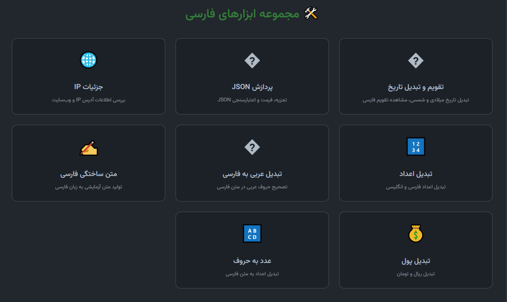
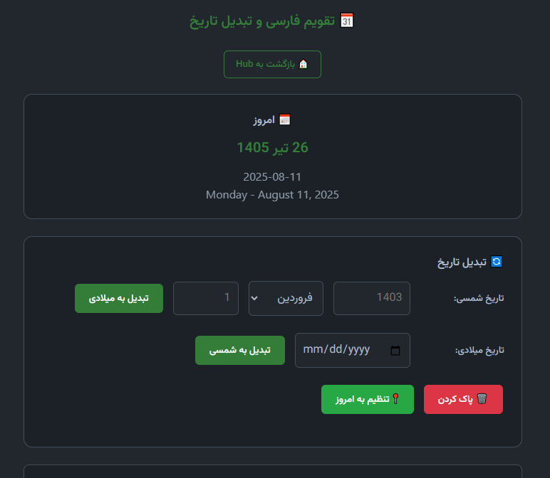
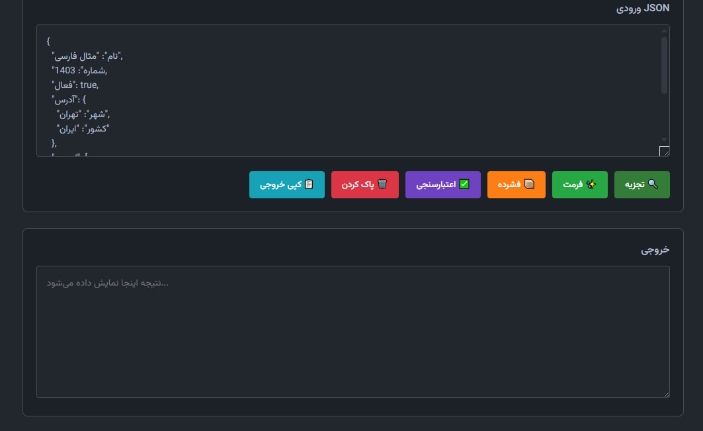
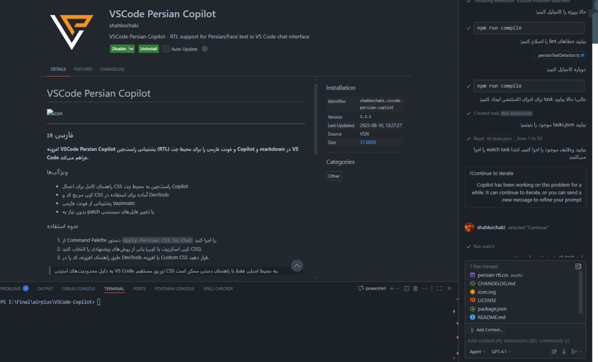

# VSCode Persian Copilot 🛠️


> **The Ultimate Persian Developer Toolkit for VS Code**

[](https://marketplace.visualstudio.com/items?itemName=shahkochaki.vscode-persian-copilot)
[](https://marketplace.visualstudio.com/items?itemName=shahkochaki.vscode-persian-copilot)
[](https://marketplace.visualstudio.com/items?itemName=shahkochaki.vscode-persian-copilot)

---

## 🚀 **COMING SOON - Exciting New Features!**

### 📝 **Persian ToDo Manager** 
> 🔜 **Coming in v1.7.0**

Get ready for the most comprehensive Persian task management system directly in VS Code:
- **📋 Smart Task Organization** - Create, manage, and organize your Persian tasks
- **⏰ Time Tracking & Deadlines** - Set Persian dates and track progress
- **🏷️ Persian Tags & Categories** - Organize with Persian labels
- **📊 Visual Progress Dashboard** - Beautiful charts and analytics
- **🔔 Smart Notifications** - Persian calendar-based reminders
- **📱 Cross-Device Sync** - Access your tasks everywhere

### 📚 **Developer Cheat Sheets Hub**
> 🔜 **Coming in v1.7.0**

The ultimate collection of Persian developer reference materials:
- **⚡ Quick Reference Cards** - Instant access to syntax and commands
- **🎨 CSS Persian Properties** - RTL-specific styling guides
- **🌐 Web Development** - HTML, CSS, JavaScript in Persian
- **🐍 Python Cheat Sheets** - Complete Python reference in Persian
- **⚛️ React & Frontend** - Modern framework guides
- **🗄️ Database Queries** - SQL and NoSQL references
- **🔧 Terminal Commands** - Linux, Windows, and Git commands
- **📐 Algorithm Templates** - Common algorithms and data structures

**💡 Stay tuned!** These features are in active development and will revolutionize your Persian development workflow.

---

## 🇬🇧 English

**VSCode Persian Copilot** is a comprehensive, professional extension that brings the Persian/Farsi developer experience to Visual Studio Code. It provides seamless right-to-left (RTL) support, a complete Persian Tools Hub, and modern typography for an enhanced coding experience.

### 🌟 Key Features

#### 🎯 **Persian Tools Hub**
Access a powerful collection of Persian development tools directly from VS Code's Activity Bar:



- **📅 Persian Calendar & Date Converter** - Convert between Persian and Gregorian dates with precision
- **🔢 Number Converter** - Convert between Persian and English numerals
- **🔤 Arabic to Persian Text Converter** - Fix Arabic characters in Persian text
- **✍️ Persian Lorem Generator** - Generate Persian placeholder text
- **💰 Money Converter** - Convert between Rial and Toman
- **🔠 Number to Words** - Convert numbers to Persian text
- **📋 JSON Parser & Formatter** - Parse, format, and validate JSON
- **🌐 IP Details Lookup** - Get detailed information about IP addresses

#### 📅 **Advanced Persian Calendar**
Professional Persian calendar with accurate date conversion algorithms:



- Real-time date conversion between Persian and Gregorian calendars
- Support for leap years and accurate calculations
- Today's date display
- User-friendly interface with Vazirmatn font

#### 📋 **JSON Tools**
Comprehensive JSON parsing and formatting capabilities:



- Parse and validate JSON with error highlighting
- Format and beautify JSON code
- Copy formatted results
- Support for large JSON files

#### 🎨 **RTL Support for Copilot Chat**
Transform your VS Code experience with proper Persian text rendering:



- Right-to-left text direction for Copilot Chat
- Beautiful Persian typography with Vazirmatn font
- Dark/Light theme compatibility
- No system file modification required

### 🚀 Quick Start

1. **Install the extension** from VS Code Marketplace
2. **Open Persian Tools Hub** by clicking the Persian Tools icon in the Activity Bar
3. **Explore the tools** - Calendar, Number Converter, JSON Parser, and more
4. **Apply RTL styles** for Copilot Chat using the provided CSS snippets

### � Installation

```bash
# Via VS Code Quick Open (Ctrl+P)
ext install shahkochaki.vscode-persian-copilot

# Or search for "VSCode Persian Copilot" in the Extensions view
```

### 📖 Usage

#### Persian Tools Hub
- Click the **Persian Tools** icon in VS Code's Activity Bar
- Select any tool from the hub interface
- Each tool opens in a dedicated webview with full functionality

#### RTL Support
- Use Command Palette: `Persian Copilot: Apply Persian CSS to Chat`
- Follow the guided instructions for DevTools or Custom CSS
- Enable auto-apply for automatic RTL styling

### 🎨 Design Philosophy

- **🛡️ Safe & Secure**: No system file patching or risky modifications
- **🎯 User-Friendly**: Intuitive interface with step-by-step guidance
- **🌙 Theme Compatible**: Works seamlessly with all VS Code themes
- **⚡ Performance**: Lightweight and fast
- **🔄 Open Source**: Fully transparent and community-driven

### �️ Technologies

- **Frontend**: HTML5, CSS3, JavaScript (ES6+)
- **Typography**: Vazirmatn font for beautiful Persian text
- **Backend**: TypeScript with VS Code Extension API
- **Build System**: ESBuild for fast compilation
- **Package Manager**: npm

### 📊 Features Overview

| Feature | Description | Status |
|---------|-------------|--------|
| Persian Calendar | Accurate Jalali-Gregorian conversion | ✅ Ready |
| Number Tools | Persian/English number conversion | ✅ Ready |
| Text Tools | Arabic to Persian conversion | ✅ Ready |
| JSON Parser | Parse, format, validate JSON | ✅ Ready |
| IP Lookup | Get IP address details | ✅ Ready |
| RTL Support | Right-to-left Copilot Chat | ✅ Ready |
| Lorem Generator | Persian placeholder text | ✅ Ready |
| Money Converter | Rial/Toman conversion | ✅ Ready |

### 🤝 Contributing

We welcome contributions! Please see our [Contributing Guidelines](CONTRIBUTING.md) for details.

1. Fork the repository
2. Create your feature branch (`git checkout -b feature/AmazingFeature`)
3. Commit your changes (`git commit -m 'Add some AmazingFeature'`)
4. Push to the branch (`git push origin feature/AmazingFeature`)
5. Open a Pull Request

### 📝 License

This project is licensed under the MIT License - see the [LICENSE](LICENSE) file for details.

### 🐛 Issues & Support

- **Report bugs**: [GitHub Issues](https://github.com/shahkochaki/vscode-persian-copilot/issues)
- **Request features**: [GitHub Discussions](https://github.com/shahkochaki/vscode-persian-copilot/discussions)
- **Email**: shahkochaki@hotmail.com

---

## 🇮🇷 فارسی

**افزونه VSCode Persian Copilot** یک مجموعه کامل و حرفه‌ای برای توسعه‌دهندگان فارسی‌زبان است که تجربه برنامه‌نویسی با VS Code را متحول می‌کند.

## 🚀 **به زودی - امکانات هیجان‌انگیز جدید!**

### 📝 **مدیریت کارهای فارسی (Persian ToDo Manager)** 
> 🔜 **در نسخه 1.7.0 عرضه می‌شود**

آماده باشید برای کامل‌ترین سیستم مدیریت کارها به زبان فارسی مستقیماً در VS Code:
- **📋 سازماندهی هوشمند کارها** - ایجاد، مدیریت و سازماندهی کارهای فارسی
- **⏰ ردیابی زمان و مهلت‌ها** - تنظیم تاریخ شمسی و پیگیری پیشرفت
- **🏷️ برچسب‌ها و دسته‌بندی فارسی** - سازماندهی با برچسب‌های فارسی
- **📊 داشبورد تصویری پیشرفت** - نمودارها و آنالیزهای زیبا
- **🔔 اعلان‌های هوشمند** - یادآوری‌ها بر اساس تقویم شمسی
- **📱 همگام‌سازی چندپلتفرمه** - دسترسی به کارهایتان در همه جا

### 📚 **مرکز برگه‌های تقلب توسعه‌دهنده - Cheat Sheet**
> 🔜 **در نسخه 1.7.0 عرضه می‌شود**

کامل‌ترین مجموعه منابع مرجع فارسی برای توسعه‌دهندگان:
- **⚡ کارت‌های مرجع سریع** - دسترسی فوری به نحو و دستورات
- **🎨 ویژگی‌های فارسی CSS** - راهنمای استایل‌دهی RTL
- **🌐 توسعه وب** - HTML، CSS، JavaScript به فارسی
- **🐍 برگه‌های تقلب Python** - مرجع کامل Python به فارسی
- **⚛️ React و فرانت‌اند** - راهنمای فریمورک‌های مدرن
- **🗄️ کوئری‌های پایگاه داده** - مرجع SQL و NoSQL
- **🔧 دستورات ترمینال** - دستورات Linux، Windows و Git
- **📐 قالب‌های الگوریتم** - الگوریتم‌ها و ساختارهای داده رایج

**💡 منتظر بمانید!** این امکانات در حال توسعه فعال هستند و گردش کار توسعه فارسی شما را متحول خواهند کرد.

---

### 🌟 امکانات کلیدی

#### 🎯 **مرکز ابزارهای فارسی**
دسترسی به مجموعه قدرتمندی از ابزارهای توسعه فارسی مستقیماً از نوار کناری VS Code:


- **📅 تقویم فارسی و تبدیل تاریخ** - تبدیل دقیق بین تاریخ شمسی و میلادی
- **🔢 تبدیل اعداد** - تبدیل بین اعداد فارسی و انگلیسی
- **🔤 تبدیل عربی به فارسی** - اصلاح حروف عربی در متن فارسی
- **✍️ تولید متن ساختگی فارسی** - تولید متن آزمایشی فارسی
- **💰 تبدیل پول** - تبدیل بین ریال و تومان
- **🔠 عدد به حروف** - تبدیل اعداد به متن فارسی
- **📋 پردازش و فرمت‌دهی JSON** - تجزیه، فرمت و اعتبارسنجی JSON
- **🌐 جستجوی جزئیات IP** - دریافت اطلاعات تفصیلی آدرس IP

#### 📅 **تقویم پیشرفته فارسی**
تقویم حرفه‌ای فارسی با الگوریتم‌های دقیق تبدیل تاریخ:


- تبدیل زنده تاریخ بین تقویم شمسی و میلادی
- پشتیبانی از سال‌های کبیسه و محاسبات دقیق
- نمایش تاریخ امروز
- رابط کاربری دوستانه با فونت وزیرمتن

#### 📋 **ابزارهای JSON**
قابلیت‌های جامع تجزیه و فرمت‌دهی JSON:


- تجزیه و اعتبارسنجی JSON با نمایش خطاها
- فرمت‌دهی و زیباسازی کد JSON
- کپی نتایج فرمت شده
- پشتیبانی از فایل‌های JSON بزرگ

#### 🎨 **پشتیبانی راست‌چین برای چت Copilot**
تبدیل تجربه VS Code با نمایش صحیح متن فارسی:


- جهت راست‌چین برای چت Copilot
- تایپوگرافی زیبای فارسی با فونت وزیرمتن
- سازگاری با تم‌های تاریک و روشن
- بدون نیاز به تغییر فایل‌های سیستم

### 🚀 شروع سریع

1. **نصب افزونه** از VS Code Marketplace
2. **باز کردن مرکز ابزارهای فارسی** با کلیک روی آیکون Persian Tools در نوار کناری
3. **کاوش در ابزارها** - تقویم، تبدیل اعداد، پردازشگر JSON و غیره
4. **اعمال استایل راست‌چین** برای چت Copilot با استفاده از کدهای CSS ارائه شده

### 🔧 نصب

```bash
# از طریق VS Code Quick Open (Ctrl+P)
ext install shahkochaki.vscode-persian-copilot

# یا جستجو برای "VSCode Persian Copilot" در بخش Extensions
```

### 📖 نحوه استفاده

#### مرکز ابزارهای فارسی
- روی آیکون **Persian Tools** در نوار کناری VS Code کلیک کنید
- هر ابزار را از رابط hub انتخاب کنید
- هر ابزار در یک webview اختصاصی با قابلیت کامل باز می‌شود

#### پشتیبانی راست‌چین
- از Command Palette استفاده کنید: `Persian Copilot: Apply Persian CSS to Chat`
- دستورالعمل‌های راهنما برای DevTools یا Custom CSS را دنبال کنید
- auto-apply را برای استایل‌دهی خودکار راست‌چین فعال کنید

### 🎨 فلسفه طراحی

- **🛡️ ایمن و امن**: بدون patch کردن فایل‌های سیستم یا تغییرات خطرناک
- **🎯 کاربر پسند**: رابط ساده با راهنمایی گام به گام
- **🌙 سازگار با تم**: کارکرد روان با تمام تم‌های VS Code
- **⚡ کارآمد**: سبک و سریع
- **🔄 متن باز**: کاملاً شفاف و مبتنی بر جامعه

### 🤝 مشارکت

ما از مشارکت شما استقبال می‌کنیم! لطفاً [راهنمای مشارکت](CONTRIBUTING.md) را برای جزئیات مطالعه کنید.

### 📝 مجوز

این پروژه تحت مجوز MIT منتشر شده است - فایل [LICENSE](LICENSE) را برای جزئیات مطالعه کنید.

### 🐛 مشکلات و پشتیبانی

- **گزارش باگ**: [GitHub Issues](https://github.com/shahkochaki/vscode-persian-copilot/issues)
- **درخواست قابلیت**: [GitHub Discussions](https://github.com/shahkochaki/vscode-persian-copilot/discussions)
- **ایمیل**: shahkochaki@hotmail.com

---

<div align="center">

**Made with ❤️ for the Persian Developer Community**

**ساخته شده با ❤️ برای جامعه توسعه‌دهندگان فارسی**

[⭐ Star on GitHub](https://github.com/shahkochaki/vscode-persian-copilot) • [📦 VS Code Marketplace](https://marketplace.visualstudio.com/items?itemName=shahkochaki.vscode-persian-copilot) • [🐛 Report Issue](https://github.com/shahkochaki/vscode-persian-copilot/issues)

</div>
- **کپی آسان CSS یا اسکریپت:** کد آماده برای DevTools یا افزونه Custom CSS فقط با یک کلیک و راهنمای گام‌به‌گام.
- **بدون تغییر فایل‌های سیستمی:** کاملاً امن و بدون نیاز به هیچ patch یا hack. همه تغییرات توسط کاربر و قابل بازگشت است.
- **سبک، مدرن و متن‌باز:** توسعه‌یافته برای جامعه برنامه‌نویسان فارسی و همیشه در حال به‌روزرسانی. مشارکت و بازخورد شما ارزشمند است!
- **مستندسازی جامع:** راهنمای کامل (انگلیسی و فارسی)، اسکرین‌شات و نکات رفع اشکال.

### 🚀 نحوه استفاده
1. از Command Palette دستور `Persian Tools Hub` یا سایر دستورات افزونه را اجرا کنید.
2. ابزارهای متنوع (تبدیل تاریخ، اعداد، تقویم، IP و ...) را در مرکز ابزارها تجربه کنید.
3. برای راست‌چین‌سازی، طبق راهنمای افزونه، کد را در DevTools یا افزونه Custom CSS قرار دهید.
4. از محیط کاملاً راست‌چین و حرفه‌ای در چت Copilot، markdown و ابزارهای فارسی لذت ببرید!

> **توجه:** به دلیل سیاست‌های امنیتی VS Code، تزریق مستقیم CSS فقط با راهنمای دستی ممکن است. این افزونه بهترین و امن‌ترین روش‌ها را به شما آموزش می‌دهد تا محیط شما همیشه پایدار و امن بماند.

### 📝 چرا این افزونه؟
- تجربه‌ای طبیعی و حرفه‌ای برای خواندن فارسی در چت Copilot، markdown و ابزارهای VS Code.
- همه ابزارهای فارسی در یک افزونه: تاریخ، عدد، متن و ...
- همیشه به‌روز و سازگار با آخرین نسخه‌های VS Code.
- مناسب تیم‌ها، مدرسین و همه علاقه‌مندان به محتوای فارسی در VS Code.

### 💡 رفع اشکال و ارتباط
در صورت بروز مشکل یا داشتن پیشنهاد، لطفاً issue یا pull request خود را در [گیت‌هاب](https://github.com/shahkochaki/vscode-persian-copilot) ثبت کنید.

---

## Screenshots


---

## License
MIT

---

**از تجربه فارسی حرفه‌ای در VS Code لذت ببرید!** 🇮🇷
